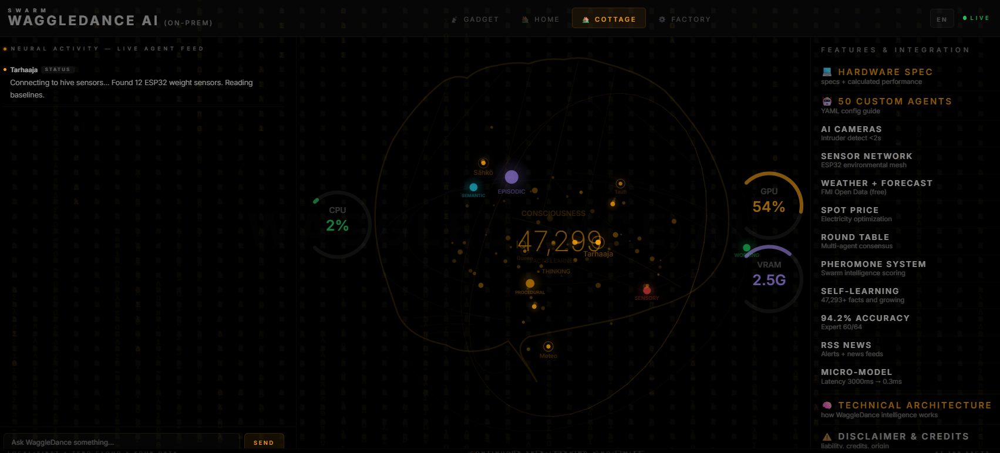

# WaggleDance AI

[](https://github.com/Ahkeratmehilaiset/waggledance-swarm/actions/workflows/tests.yml)


**A local-first, solver-first AI runtime that routes each task to the right reasoning layer — solvers, specialist models, memory, or LLM — with full audit trail and autonomous learning.**

WaggleDance runs on your own hardware and selects the best available method for each task: physics solvers for calculations, trained specialists for classification, memory for recall, rules for constraints, and LLMs only when reasoning or language generation is actually needed.

The system was developed in a demanding real-world field environment (Finnish commercial beekeeping) and is being generalized into a broader runtime for sensor-rich, domain-specific applications.

## Deployment Profiles

| Profile | Environment | Example use cases |
|---------|-------------|-------------------|
| **GADGET** | IoT, edge | Battery life, signal quality, sensor calibration |
| **COTTAGE** | Off-grid property | Heating cost, frost protection, colony health, seasonal tasks |
| **HOME** | Smart home | Energy optimization, safety alerts, comfort |
| **FACTORY** | Industrial | OEE analysis, SPC monitoring, predictive maintenance |



Validated with 79 legacy suites (1468 tests) and 3836 pytest tests — over 5300 total, 0 failures. No subscription, no external API keys required for core operation.

---

## Architecture Overview

WaggleDance has three integrated stacks:

| Stack | Purpose | Entrypoint |
|-------|---------|------------|
| **Legacy** | Production HiveMind orchestrator with 128 YAML agents | `start.py` / `main.py` |
| **Hexagonal** | Ports & adapters runtime with DI container | `waggledance.adapters.cli.start_runtime` |
| **Autonomy** | Solver-first runtime with capability contracts | `waggledance.core.autonomy.runtime` |

The autonomy runtime is the primary path (`runtime.primary: waggledance` in settings.yaml). Legacy runs in parallel for backward compatibility.

### Autonomy Runtime — Solver-First, 3-Layer

```
Query → Intent Classification → Capability Selection → Policy Check → Execution → Verification → Case Recording

Layer 3 (Authoritative): Solvers, axioms, constraints, verifiers
Layer 2 (Learned):       Specialist trained models with canary lifecycle
Layer 1 (Fallback):      LLM via capability contracts, quality-gated
```

Each query follows the path: **solve it if possible, learn from specialists if available, ask the LLM only as last resort**. Every execution produces a CaseTrajectory graded as gold/silver/bronze/quarantine — feeding back into overnight learning.

### Capability Registry

29 builtin capabilities across 8 categories, 20 executors bound at startup:

| Category | Capabilities | Examples |
|----------|-------------|---------|
| **SOLVE** | 8 | math, symbolic, constraints, thermal, stats, causal, pattern match, bee domain |
| **RETRIEVE** | 3 | hot cache, semantic search, vector search |
| **SENSE** | 7 | intent classify, MQTT, Home Assistant, Frigate, audio, fusion, seasonal |
| **DETECT** | 3 | seasonal rules, anomaly, routing analysis |
| **VERIFY** | 3 | hallucination, consensus, English output |
| **NORMALIZE** | 2 | Finnish, translation |
| **EXPLAIN** | 1 | LLM reasoning |
| **OPTIMIZE** | 1 | schedule/energy |

Capabilities are defined in Python (registry builtins) and enriched from YAML configs (`configs/capabilities/*.yaml`). Each has preconditions, success criteria, and rollback support.

### MAGMA Integration

The autonomy runtime integrates MAGMA (Memory Architecture for Grounded Multi-Agent AI) adapters:

- **AuditProjector** — structured audit events for the full autonomy lifecycle
- **EventLogAdapter** — policy decisions, case trajectories, capability selections
- **TrustAdapter** — per-capability trust scoring from execution outcomes
- **ReplayAdapter** — mission replay with world snapshots before/after
- **ProvenanceAdapter** — fact provenance with source type and confidence

All MAGMA adapters are optional and fail-safe — the runtime never breaks if an adapter is unavailable.

### Persistence

SQLite-backed stores for durable state:

- **WorldStore** — world model snapshots
- **ProceduralStore** — proven capability chains and anti-patterns
- **CaseStore** — case trajectories with quality grades
- **VerifierStore** — verification results per action

### Night Learning v2

The NightLearningPipeline runs overnight and performs:

1. **Case grading** — QualityGate evaluates day's trajectories (gold/silver/bronze/quarantine)
2. **Specialist training** — trains 8 specialist models from gold/silver cases
3. **Canary evaluation** — 48h canary period, auto-promote or auto-rollback
4. **Procedural memory** — gold cases → proven chains, quarantine → anti-patterns
5. **Morning report** — summary of overnight learning activity

The pipeline is wired through the hexagonal path: `Container → AutonomyService.run_learning_cycle()`. Specialist accuracy metrics are emitted from canary evaluation results.

### Proactive Goals

The runtime can detect deviations in the world model and autonomously propose diagnostic goals:

- `AutonomyRuntime.check_proactive_goals(observations)` computes residuals against baselines
- Deviations exceeding a threshold generate `diagnose` goals via GoalEngine
- Each proposed goal is tracked in the `proactive_goals_today` KPI

### Safety Cases

High-risk actions are documented with structured safety arguments:

- Evidence from historical success rate, verifier pass rate, procedural memory, risk scores
- Verdict: `safe`, `needs_review`, or `unsafe`
- Accessible via `GET /api/autonomy/safety-cases`

### KPI Tracking

13 autonomy KPIs tracked in real-time:

| KPI | Target | Description |
|-----|--------|-------------|
| Route accuracy | >90% | Correct routing decisions |
| Capability chain success | >75% | Full chain executions without failure |
| Verifier pass rate | >85% | Actions passing verification |
| LLM fallback rate | <30% | Queries requiring LLM (lower = better) |
| Specialist accuracy | >85% | Per-model prediction accuracy |
| Proactive goal rate | >5/day | Autonomously proposed goals |
| Night learning gold rate | >40% | Cases graded gold |

---

## Key Features

- **Solver-first routing** — 29 capabilities across 8 categories, solvers tried before LLM
- **128 specialized agents** communicating through HiveMind orchestrator (5 trust levels, persistent SQLite trust store)
- **Elastic scaling** — auto-detects GPU/RAM/CPU at startup, selects optimal model tier
- **Finnish NLP** — Voikko lemmatization + compound splitting + Opus-MT translation
- **Vector memory** — ChromaDB with bilingual FI+EN index
- **Round Table consensus** — up to 6 agents debate and cross-validate answers
- **MicroModel routing** — V1 (pattern match) + V2 (neural classifier) with canary promotion
- **Smart home sensors** — MQTT hub, Frigate NVR cameras, Home Assistant bridge, Telegram/webhook alerts
- **Audio sensors** — ESP32 bee audio analysis, BirdNET integration
- **Voice interface** — Whisper STT (Finnish) + Piper TTS, wake word activation
- **External data feeds** — FMI weather, electricity spot prices, RSS alerts
- **MAGMA memory architecture** — append-only audit, selective replay, provenance, trust scoring
- **Cognitive Graph** — NetworkX knowledge graph with causal/semantic edges
- **Night learning v2** — autonomous overnight learning with specialist training and canary lifecycle
- **Safety cases** — structured safety arguments for high-risk actions
- **Domain engines** — bee colony health, swarm risk, seasonal calendar (profile-gated)
- **Proactive goals** — autonomous goal generation from world model deviations
- **Resource kernel** — admission control with accept/defer/reject based on system load
- **4 deployment profiles** — GADGET / COTTAGE / HOME / FACTORY with domain-agnostic dashboard

---

## Limitations & Known Issues

- **Single developer project** — not yet validated by external users
- **Finnish beekeeping origin** — domain engines (bee, seasonal) are profile-gated; other domains require new capability adapters
- **Bearer token authentication** — auto-generated on first startup; `/health` and `/ready` are public
- **No TLS** — use nginx/Caddy if exposing beyond localhost
- **Single-node only** — no clustering or distributed deployment
- **Specialist models** — training pipeline validated with simulated accuracy; real ML training (sklearn/PyTorch) is a placeholder
- **MicroModel V3 (LoRA)** — Phi-3.5-mini pipeline validated, full training deferred
- **CI runs pytest only** — full legacy validation still requires local `tools/waggle_backup.py`
- **GADGET and FACTORY tiers** — theoretical, not tested on actual hardware
- **Performance numbers** — self-measured, not independently verified
- **MAGMA persistence** — wired and functional but not production-tested at scale

---

## Documentation

| Document | Description |
|----------|-------------|
| [Architecture](docs/ARCHITECTURE.md) | System overview, components, data flow |
| [Autonomy Runtime](docs/AUTONOMY_RUNTIME.md) | Solver-first runtime, capability contracts |
| [Capability Model](docs/CAPABILITY_MODEL.md) | 29 capabilities, categories, wiring |
| [Night Learning v2](docs/NIGHT_LEARNING_V2.md) | Learning pipeline, quality gates, specialist training |
| [Specialist Models](docs/SPECIALIST_MODELS.md) | 8 specialist models, canary lifecycle |
| [API Reference](docs/API.md) | REST endpoints + WebSocket protocol |
| [Deployment](docs/DEPLOYMENT.md) | Docker, native install, profiles, hardware requirements |
| [Security](docs/SECURITY.md) | Threat model, mitigations, secrets management |
| [Sensors & Integrations](docs/SENSORS.md) | MQTT, Frigate, HA, audio, voice, alerts |
| [Port Contracts](docs/PORT_CONTRACTS.md) | 8 protocol interfaces |
| [State Ownership](docs/STATE_OWNERSHIP.md) | Single-writer rules |
| [Entrypoints](docs/ENTRYPOINTS.md) | Legacy vs hexagonal vs autonomy runtime |
| [Data & Migrations](docs/MIGRATIONS.md) | Database schemas, backup/restore |

---

## Language Architecture

WaggleDance processes non-English input through a morphological engine before the LLM sees it:

```
Your Language → Morphological Engine → Lemmatization → Compound Splitting
    → Spell Correction → Translation → LLM (English) → Back-Translation → Your Language
```

For Finnish, Voikko resolves grammar, inflections, and compound words. English queries skip translation entirely for faster response.

| Language | Engine | Notes |
|----------|--------|-------|
| Finnish | **Voikko** (bundled) | Lemmatization, compound splitting, spell correction |
| German, Spanish, French | Hunspell | Widely available, many dictionaries |
| Japanese | MeCab | Morphological analysis + tokenization |
| **English** | **None needed** | Direct LLM path, no translation overhead |

---

## How Self-Learning Works

WaggleDance learns through two pathways:

### Continuous Learning (Day)
Every query produces a CaseTrajectory: intent → capability selection → execution → verification → quality grade. These accumulate during the day.

### Night Learning v2 (Overnight)
The NightLearningPipeline processes the day's cases:

```
Day Cases → Quality Gate → Specialist Training → Canary (48h) → Procedural Memory → Morning Report
                ↓                    ↓                  ↓                ↓
           gold/silver/         8 specialist       promote or       proven chains
           bronze/quarantine    models trained      rollback         anti-patterns
```

### MicroModel Routing
- V1 Pattern Match — regex + lookup table, ~0.01ms
- V2 Neural Classifier — PyTorch 768→256→128→N, ~1ms, trains on collected pairs
- Topic auto-promotion — 200+ pairs + <3% error → promoted to fast path

### Round Table — Agent Consensus
Every 20 heartbeats, up to 6 agents hold a structured debate, cross-validate answers, and store consensus as high-confidence facts.

---

## System Architecture

```
User (Finnish / English) → FastAPI (port 8000)
  │
  ├── Autonomy Runtime (solver-first, primary path)
  │   ├── SolverRouter — intent classification + capability selection
  │   ├── CapabilityRegistry — 29 capabilities, 20 bound executors
  │   ├── PolicyEngine — deny-by-default + safety cases
  │   ├── SafeActionBus — policy-checked execution
  │   ├── Verifier — outcome validation
  │   ├── WorldModel — baselines, residuals, snapshots
  │   ├── GoalEngine — lifecycle: propose → plan → execute → verify
  │   ├── CaseTrajectoryBuilder — learning data capture
  │   └── MAGMA Adapters — audit, events, trust, replay, provenance
  │
  ├── Compatibility Layer (routes to legacy if needed)
  │   └── HiveMind Orchestrator (hivemind.py, 128 agents)
  │
  ├── Application Services
  │   ├── AutonomyService — queries, missions, learning, safety cases
  │   ├── ChatService — routing policy + orchestrator
  │   ├── MemoryService — vector store operations
  │   └── LearningService — night learning coordination
  │
  ├── Adapters
  │   ├── Capabilities — 23 adapters (math, thermal, stats, causal, bee domain, ...)
  │   ├── Sensors — MQTT, Frigate, Home Assistant, audio, fusion
  │   ├── Persistence — SQLite stores (world, procedural, cases, verifier)
  │   ├── Memory — ChromaDB, HotCache, shared memory
  │   └── Trust — SQLite trust store with InMemory fallback
  │
  ├── Sensors & Integrations
  │   ├── MQTT Hub — paho-mqtt, reconnect, dedup
  │   ├── Frigate NVR — camera events, severity alerts
  │   ├── Home Assistant — REST poll
  │   ├── Audio — ESP32 bee audio + BirdNET
  │   ├── Voice — Whisper STT + Piper TTS
  │   ├── Data Feeds — FMI weather, electricity, RSS
  │   └── Alerts — Telegram + webhook
  │
  └── Dashboard (Vite + React, domain-agnostic)
      ├── Profile switching (GADGET/COTTAGE/HOME/FACTORY)
      ├── Interactive chat (FI/EN)
      ├── CPU / GPU / VRAM gauges
      ├── Agent heartbeat feed
      ├── Analytics, Round Table, Agent Grid
      ├── Persistent chat history
      └── User feedback (thumbs up/down)
```

---

## Hardware Scaling

WaggleDance auto-detects hardware at startup:

```
VRAM < 2GB   → MINIMAL:       No LLM, V1 pattern match only
VRAM 2-4GB   → LIGHT:         qwen3:0.6b + smollm2:135m, 2 agents
VRAM 4-16GB  → STANDARD:      phi4-mini + llama3.2:1b, 6 agents
VRAM 16-48GB → PROFESSIONAL:  phi4:14b + qwen3:4b, 15 agents + vision
VRAM 48GB+   → ENTERPRISE:    llama3.3:70b + llama3.1:8b, 75 agents
```

**Development hardware:** NVIDIA RTX A2000 8GB + 128GB RAM → STANDARD tier.

**Note:** Only STANDARD tier is tested in production. MINIMAL, PROFESSIONAL, and ENTERPRISE tiers are implemented but not hardware-validated.

---

## Installation

See [docs/DEPLOYMENT.md](docs/DEPLOYMENT.md) for detailed instructions.

### Option A: Docker (recommended)

```bash
git clone https://github.com/Ahkeratmehilaiset/waggledance-swarm.git
cd waggledance-swarm
cp .env.example .env    # Edit with your secrets
docker compose up -d
```

Pull required models (one-time, ~3GB total):

```bash
docker compose exec ollama ollama pull phi4-mini
docker compose exec ollama ollama pull llama3.2:1b
docker compose exec ollama ollama pull nomic-embed-text   # Required for memory
docker compose exec ollama ollama pull all-minilm
```

Open **http://localhost:8000**.

### Option B: Native Install

```bash
# 1. Install Ollama (https://ollama.ai)
# 2. Pull models
ollama pull phi4-mini && ollama pull llama3.2:1b
ollama pull nomic-embed-text && ollama pull all-minilm

# 3. Clone and install
git clone https://github.com/Ahkeratmehilaiset/waggledance-swarm.git
cd waggledance-swarm
pip install -e .

# 4. Run (autonomy runtime — recommended)
python -m waggledance.adapters.cli.start_runtime

# Or: legacy runtime
python start.py --production
```

### Stub Mode (No Ollama)

```bash
python -m waggledance.adapters.cli.start_runtime --stub
# Or: python start.py --stub
```

### Verify Installation

```bash
python -m pytest -q                          # 3836 tests
python tools/waggle_backup.py --tests-only   # 79 legacy suites, 1468 tests
```

---

## Project Structure

```
waggledance-swarm/
├── waggledance/                # Hexagonal + autonomy runtime (~21,800 lines, 172 files)
│   ├── core/                   #   Domain models, autonomy, reasoning, capabilities, learning
│   │   ├── autonomy/           #     Runtime, lifecycle, metrics, resource kernel, compatibility
│   │   ├── capabilities/       #     Registry (29 builtins), selector, aliasing
│   │   ├── reasoning/          #     10 reasoning engines (thermal, stats, causal, bee, seasonal, ...)
│   │   ├── learning/           #     Night learning pipeline, case builder, quality gate, procedural
│   │   ├── specialist_models/  #     Trainer, model store, canary lifecycle
│   │   ├── goals/              #     Goal engine, mission store, decomposition
│   │   ├── world/              #     World model, baselines, entity registry
│   │   ├── policy/             #     Policy engine, safety cases, constitution
│   │   ├── magma/              #     Audit, events, trust, replay, provenance adapters
│   │   └── domain/             #     Pydantic DTOs (Goal, CaseTrajectory, QualityGrade, ...)
│   ├── application/            #   Services (autonomy, chat, memory, learning, readiness)
│   ├── adapters/               #   23 capability adapters, 5 sensor adapters, HTTP routes, CLI
│   │   ├── capabilities/       #     Math, thermal, stats, causal, bee domain, seasonal, ...
│   │   ├── sensors/            #     MQTT, Frigate, HA, audio, fusion
│   │   ├── persistence/        #     SQLite stores (world, procedural, cases, verifier)
│   │   ├── http/               #     FastAPI routes (chat, memory, status, autonomy)
│   │   └── cli/                #     start_runtime entrypoint
│   └── bootstrap/              #   DI container, capability loader, event bus
├── core/                       # Legacy modules (memory_engine, routing, translation, ...)
├── integrations/               # Legacy sensors (MQTT, Frigate, HA, audio, voice, feeds)
├── agents/                     # 128 YAML agent knowledge bases
├── configs/                    # settings.yaml, capabilities/*.yaml, capsules, policies
├── dashboard/                  # Vite + React UI (domain-agnostic, profile-switching)
├── tests/                      # 177 test files (3836 pytest tests + 79 legacy suites)
├── tools/                      # Backup, migration, benchmarks, training scripts
├── docs/                       # Architecture, API, deployment, security, sensors
├── hivemind.py                 # HiveMind orchestrator (~1382 lines)
├── start.py                    # Launcher (--stub / --production / --new-runtime)
├── Dockerfile                  # Python 3.13 + Voikko + healthcheck
└── docker-compose.yml          # Ollama + WaggleDance stack
```

---

## API Endpoints

### Autonomy Runtime (new in v2.0.0)

| Endpoint | Method | Description |
|----------|--------|-------------|
| `/api/autonomy/status` | GET | Full runtime status, KPIs, resource kernel |
| `/api/autonomy/kpis` | GET | 13 autonomy KPIs with targets |
| `/api/autonomy/learning/run` | POST | Trigger night learning cycle |
| `/api/autonomy/learning/status` | GET | Pipeline status and history |
| `/api/autonomy/goals/check-proactive` | POST | Check world model for proactive goals |
| `/api/autonomy/safety-cases` | GET | Recent safety cases |
| `/api/autonomy/safety-cases/stats` | GET | Safety case verdict distribution |

### Core

| Endpoint | Method | Description |
|----------|--------|-------------|
| `/health` | GET | Liveness probe |
| `/ready` | GET | Readiness probe |
| `/api/chat` | POST | Chat (auto FI/EN) |
| `/api/memory/ingest` | POST | Store content in memory |
| `/api/memory/search` | POST | Semantic search |

See [docs/API.md](docs/API.md) for the complete list (~70+ endpoints including legacy).

---

## Performance

All measurements on HP ZBook with NVIDIA RTX A2000 8GB + 128GB RAM, internal test suites.

| Metric | Value | Notes |
|--------|-------|-------|
| Test coverage | 79 legacy + 3836 pytest | ~5300 total, 0 failures |
| Capabilities | 29 registered, 20 bound | 8 categories |
| Hot Cache response | ~0.5ms | Pre-computed answers |
| MicroModel V1 | ~0.01ms | Pattern match |
| MicroModel V2 | ~1ms | Neural classifier |
| ChromaDB search | ~55ms | Bilingual FI+EN |
| Full LLM response | 500-3,000ms | phi4-mini, varies by complexity |
| Night learning | 400-640 facts/night | ~50-80 facts/hour over 8h |
| Specialist models | 8 types | Simulated training (real ML is placeholder) |

---

## Security

See [docs/SECURITY.md](docs/SECURITY.md) for full threat model.

- **Localhost-only** — Bearer token auth for API, single-user design
- **No TLS** — use a reverse proxy for network exposure
- **Rate limiting** — 60 req/min per IP
- **Input validation** — Pydantic models, size limits
- **Deny-by-default policy** — PolicyEngine checks every action before execution
- **Safety cases** — structured safety arguments for high-risk actions
- **Secrets in .env** — git-ignored, never committed

---

## Contributing

1. Fork the repository
2. Create a feature branch (`git checkout -b feature/my-feature`)
3. Run tests: `python -m pytest -q`
4. Ensure all tests pass
5. Submit a pull request

### Development Setup

```bash
python -m waggledance.adapters.cli.start_runtime --stub   # No Ollama needed
cd dashboard && npm run dev                                # React dev server
```

---

## Credits

Created by **Jani Korpi** (JKH Service / Ahkerat Mehiläiset, Helsinki).
Built with significant assistance from [Claude](https://claude.ai) (Anthropic) as AI coding partner.

---

## License

MIT — Free to use, modify, distribute.

---

**Disclaimer:** This system is provided as-is under the MIT license. Use at your own risk. Not intended for critical infrastructure without human oversight.

---

<p align="center">
  <strong>Ahkerat Mehiläiset &middot; Helsinki, Finland &middot; 2024-2026</strong>
</p>
